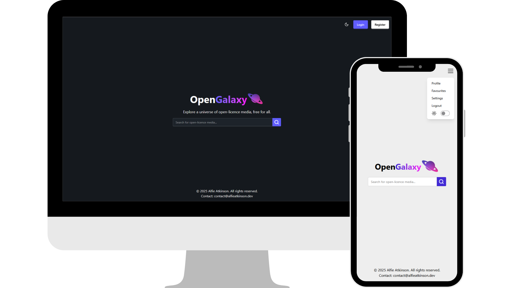

    
    
A full-stack web application for browsing and managing open-license media.

    
    
    
    
    
    
    
    
    
    
    
    
    
    
    

---

## Table of Contents

---

## Overview

**OpenGalaxy** is a full-stack web app built for discovering, searching, and curating Creative Commons licensed media. It fetches media from the [Openverse API](https://api.openverse.org/v1/) and offers users personalisation through accounts, favourites, and search history. This project is submitted in partial fulfilment of the Degree of **Master of Science in Computer Science**.

    

---

## Tech Stack

